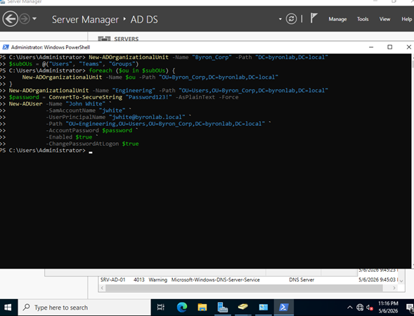
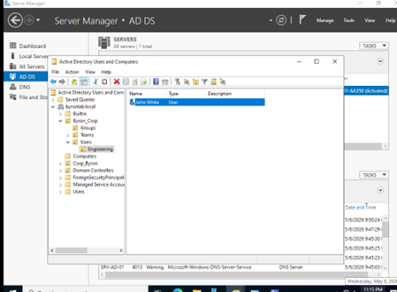
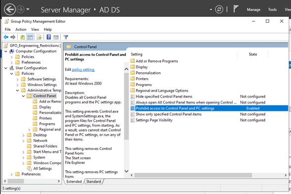
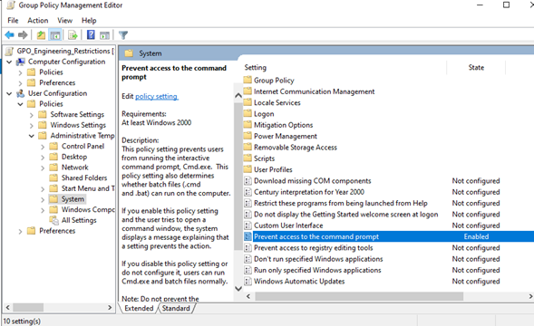
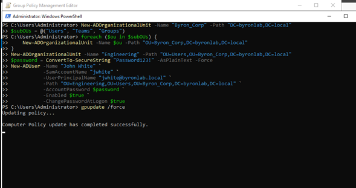
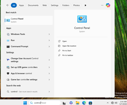
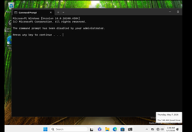

# Infrastructure & Network Administration Portfolio
**Byron Armando Monzón Alman** | *Telecommunications Engineer*

---

## Project: Identity Automation & Workstation Hardening with Active Directory (AD DS)

###  Project Description
This project demonstrates the deployment of a virtualized corporate network infrastructure built on VMware Workstation. It utilizes Windows Server 2022 as the primary Domain Controller (`byronlab.local`) and a Windows 11 Enterprise host acting as the corporate workstation.

The core focus of this deployment is achieving operational efficiency through **Infrastructure as Code (PowerShell Automation)** and enforcing strict security baseline standards via **Workstation Hardening** using Group Policy Objects (GPOs).

###  Tech Stack & Core Tools
* **OS:** Windows Server 2022, Windows 11 Enterprise
* **Directory Services:** Active Directory Domain Services (AD DS), Integrated DNS
* **Automation:** PowerShell Scripting
* **Security:** Group Policy Objects (GPOs), Least Privilege Enforcement
* **Virtualization:** VMware Workstation (Isolated LAN Segmentation)

---

###  Implementation Phases

#### 1. Network Infrastructure & Virtual Lab Setup
Both virtual machines were isolated within a dedicated custom LAN segment in VMware to mimic a secure corporate access layer. Static IP addressing was assigned to the Domain Controller, and DNS forwarders were structured so that the Windows 11 host could natively resolve the hierarchical AD namespace.

#### 2. Directory Deployment Automation via PowerShell
To minimize manual errors and optimize deployment times, a custom PowerShell script was executed to automatically build the root Organizational Unit (`Byron_Corp`), its functional sub-OUs (`Users`, `Teams`, `Groups`), the departmental sub-OU (`Engineering`), and provision a technical user account for **John White** (`jwhite`) with a forced password reset on initial logon:

```powershell
# Initialize Root and Sub-OU Structure
New-ADOrganizationalUnit -Name "Byron_Corp" -Path "DC=byronlab,DC=local"
$subOUs = @("Users", "Teams", "Groups")
foreach ($ou in $subOUs) {
    New-ADOrganizationalUnit -Name $ou -Path "OU=Byron_Corp,DC=byronlab,DC=local"
}
New-ADOrganizationalUnit -Name "Engineering" -Path "OU=Users,OU=Byron_Corp,DC=byronlab,DC=local"

# Secure Technical User Provisioning
$password = ConvertTo-SecureString "Password123!" -AsPlainText -Force
New-ADUser -Name "John White" -SamAccountName "jwhite" `
           -UserPrincipalName "jwhite@byronlab.local" `
           -Path "OU=Engineering,OU=Users,OU=Byron_Corp,DC=byronlab,DC=local" `
           -AccountPassword $password -Enabled $true -ChangePasswordAtLogon $true
```
## Deployment & Provisioning Evidence:



Figure 1: PowerShell ISE console successfully processing the automation logic.



Figure 2: Active Directory Users and Computers console reflecting the clean OU hierarchy and newly created corporate user.

### 3. Security Hardening via GPO (Workstation Hardening)
To mitigate internal attack vectors and prevent unauthorized systemic modifications on client workstations, a restrictive policy named GPO_Engineering_Restrictions was created and linked exclusively to the Engineering sub-OU.

Enforced Security Baselines:
Control Panel Restriction: Enabled the "Prohibit access to Control Panel and PC settings" directive to prevent modifications to network adapters, security settings, or system configurations.

Interactive Shell Mitigation (CMD Block): Enabled "Prevent access to the command prompt", which dynamically drops and blocks interactive command-line access upon execution, preventing unprivileged script execution.




Figures 3 & 4: Group Policy Management Editor mapping specific user-level restrictions.

To guarantee immediate domain-wide distribution of the security baselines without waiting for default update intervals, a forced policy refresh was triggered on the server:



Figure 5: Successfully running gpupdate /force on the Domain Controller terminal.

### Operational Validation & Client Testing (Windows 11)
After successfully joining the Windows 11 workstation to the domain, logging in with the network credentials (jwhite@byronlab.local), and completing the mandatory password change, the environment was audited to verify the GPO constraints:

A. Control Panel Interception Test:
The operating system intercepts user access and immediately triggers an administrative restriction message.




Figures 6 & 7: Evidence of successful mitigation preventing John White from accessing core operating system settings.

B. Command Prompt (CMD) Execution Test:
When attempting to open the terminal, the active Group Policy intercepts the process and automatically kills the window as soon as a key is pressed, effectively rendering the interactive shell useless to the end-user.




Figures 8 & 9: Technical validation demonstrating active shell mitigation on the Windows 11 host.

### Interactive Video Demonstration
To review the live validation flow (Domain authentication, forced password reset process, and visual GPO restriction auditing), you can play the project video demo through the following link:

Watch the Interactive Project Demo Video Here

This lab is a part of my technical validation series focused on Systems Administration, Network Services, and Infrastructure Engineering.
